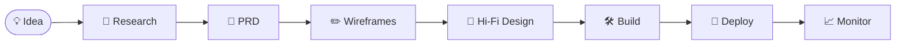
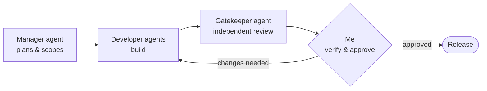

 

---

## 👋 About me

I take software from idea to production: research, product requirements, wireframes and hi-fi design, system design, AI-assisted builds, deployment and monitoring.

I build with AI coding agents, and I own everything around the code: clear requirements, documented decisions, safe deployment, and knowing when something breaks.

## 🔁 From idea to production

## 🧭 What I do

| | Area | What it covers |
|:-:|---|---|
| 🎨 | **Product & system design** | PRDs with users and roles, user flows, business rules, wireframes and hi-fi designs |
| 🤖 | **AI-native building** | AI coding agents organised like a team, with an independent review before every release |
| 🛡️ | **Self-hosted DevOps & security** | Docker deployments, private server access, secrets management, monitoring, alerts and backups |

## 🤖 How I build with AI agents

Every decision is written down: PRDs, architecture notes and decision records. Production releases are always approved by me, never automatic.

## 🧰 Tools I work with

**Plan & design** 

**Build with AI** 

**Deploy & run** 

## 🚀 Selected work

> Most of my project code is private. Each project is at a different stage.

<table>
<tr>
<td width="50%" valign="top">

### ☀️ Sasta Inverter
A solar marketplace for Pakistan, built end to end: product discovery, seller workflows and order management, with access control and deployment.

</td>
<td width="50%" valign="top">

### 🕌 DMRA Student Hub
An operations system for a madrasa: attendance, Quran progress (Sabaq, Sabqi, Manzil) and parent updates (WhatsApp in setup), with human approval before records are saved or messages are sent.

 
[Architecture walkthrough →](https://x.com/hafizahmedzia/status/2099909941377048924)

</td>
</tr>
<tr>
<td width="50%" valign="top">

### 🖥️ Self-hosted platform
Three cloud servers with private management access, Docker deployments, central monitoring (Grafana, Loki, VictoriaMetrics) and alerts.

</td>
<td width="50%" valign="top">

### 🦀 Hafiz Rust Gateway
An open-source research project on streaming and failure handling between AI applications and model providers.

 
[Explore the repository →](https://github.com/hafizahmedzia/hafiz-rust-gateway)

</td>
</tr>
</table>

## 📌 Right now

- ✍️ Writing case studies for my projects
- 🔐 Learning more about networking and security
- 🤝 Open to scoped projects with international founders and software agencies

## 📫 Work together

Send me the problem, your current setup and the outcome you want. Written briefs and chat work well for me.

