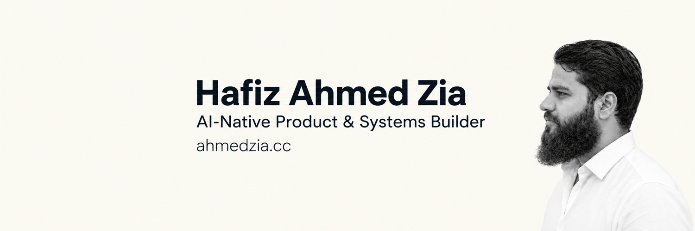

**[ahmedzia.cc](https://ahmedzia.cc)** · [LinkedIn](https://www.linkedin.com/in/hafizahmedzia/) · [X](https://x.com/hafizahmedzia) · [hello@ahmedzia.cc](mailto:hello@ahmedzia.cc) · Pakistan (UTC+5) · Open to international projects

## About

I take software from idea to production: research, product requirements, wireframes and hi-fi design, AI-assisted builds, deployment and monitoring.

I build with AI coding agents, and I own everything around the code: clear requirements, written decisions, safe deployment, and knowing when something breaks.

## What I do

| Area | What it covers |
| --- | --- |
| **Product & system design** | PRDs with users and roles, user flows, business rules, wireframes and hi-fi designs |
| **AI-native building** | AI coding agents organised like a team, with an independent review before every release |
| **Self-hosted DevOps** | Docker deployments, private server access, secrets management, monitoring and alerts |

## How I build with AI agents

1. **Manager agent** splits the work into small tasks with acceptance checks.
2. **Developer agents** build and test each task.
3. **Gatekeeper agent** reviews the work independently and sends it back when something is missing.
4. **I** read the diff and the test report, then approve. Production releases are always my manual decision.

Every decision is written down: PRDs, architecture notes and decision records.

## Tools

**Plan & design** — Penpot, Markdown, decision records 
**Build** — Claude Code, Codex, Antigravity, TypeScript, Rust, Astro, React, SurrealDB, Flutter 
**Run** — Docker, Dokploy, Cloudflare, Tailscale, Grafana, Loki, VictoriaMetrics, Uptime Kuma, Infisical, n8n

## Selected work

Most of my project code is private. Each project is listed at its real stage.

| Project | What it is | Stage |
| --- | --- | --- |
| **Sasta Inverter** | A solar marketplace for Pakistan, built end to end: product discovery, seller workflows and order management, with access control and deployment. | Live on staging |
| **DMRA Student Hub** | An operations system for a madrasa: attendance, Quran progress and parent updates, with human approval before records are saved or messages are sent. [Architecture walkthrough](https://x.com/hafizahmedzia/status/2099909941377048924) | In production |
| **Self-hosted platform** | Three cloud servers with private management access, Docker deployments, central monitoring and alerts. | In daily use |
| **[Hafiz Rust Gateway](https://github.com/hafizahmedzia/hafiz-rust-gateway)** | An open-source research project on streaming and failure handling between AI applications and model providers. | Pre-alpha |

## Now

- Writing case studies for my projects
- Learning more about networking and security
- Open to scoped projects with international founders and software agencies

## Work together

Send me the problem, your current setup and the outcome you want. I reply in writing with how I would approach it.

**[Start a project at ahmedzia.cc →](https://ahmedzia.cc)** or email [hello@ahmedzia.cc](mailto:hello@ahmedzia.cc).
